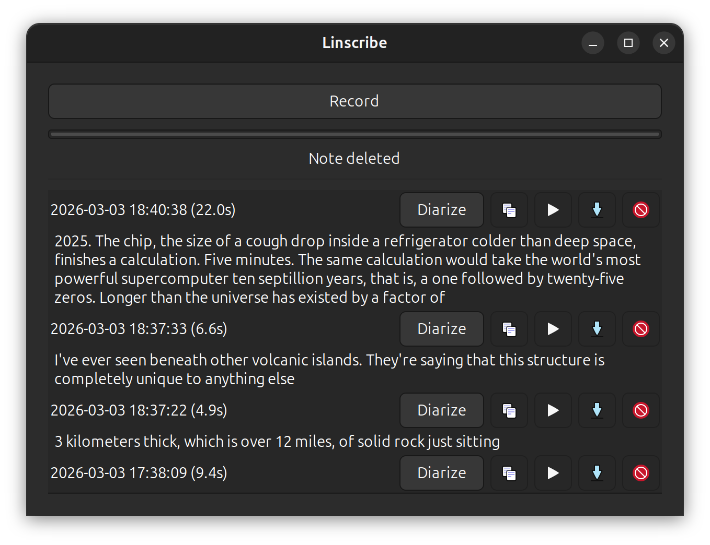
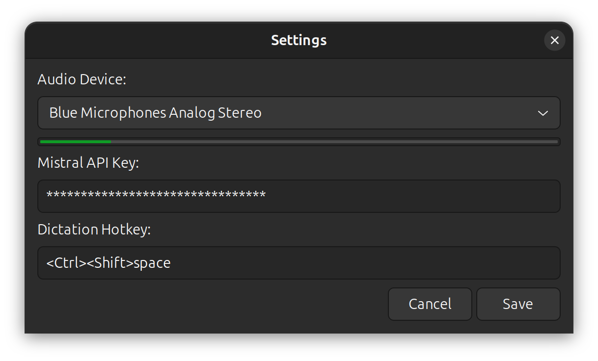
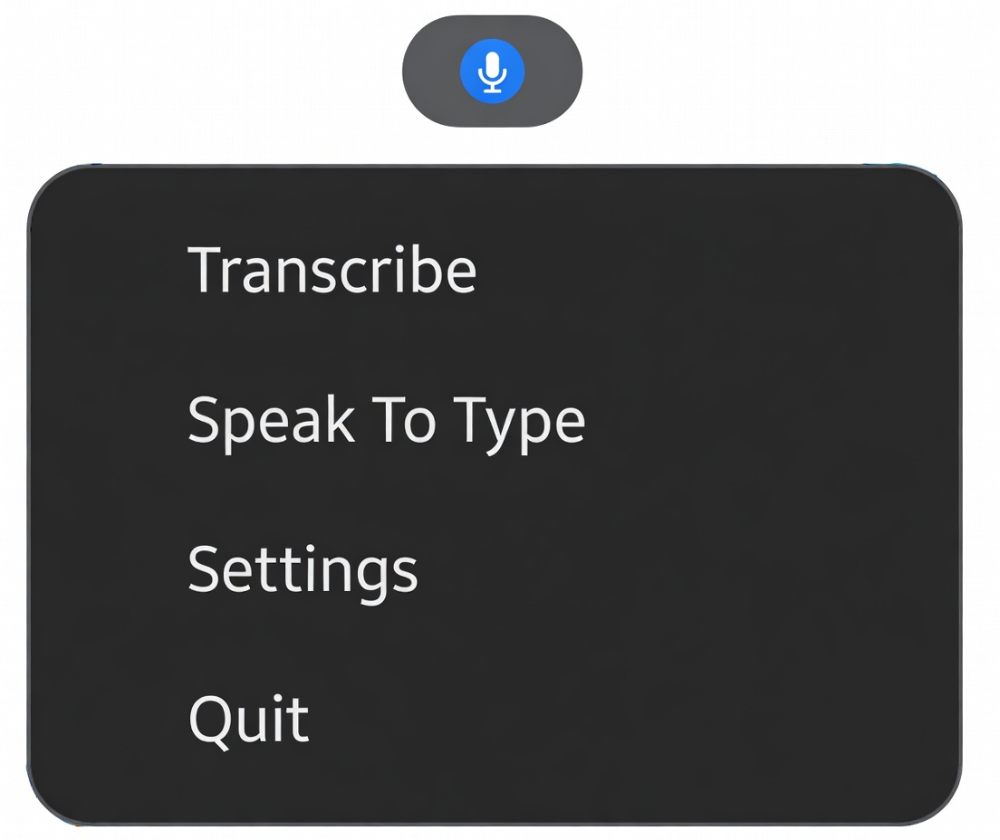

# Linscribe

A lightweight Linux desktop app for voice notes, transcription, and system-wide speech-to-text dictation. Lives in your system tray, records voice memos with one click, transcribes them with speaker diarization, and can type transcribed speech directly into any focused application.

Powered by [Mistral's Voxtral](https://docs.mistral.ai/capabilities/audio/) real-time and batch transcription APIs.

<p align="center">
  
</p>

## Features

### Voice Notes

Record, transcribe, and manage voice memos from a minimal GTK3 window.

- **Live transcription** &mdash; speech appears on screen in real time as you record, in a scrollable view that keeps up with long recordings
- **Batch transcription** &mdash; transcribe any saved note with one click
- **Speaker diarization** &mdash; identify who said what in multi-speaker recordings, with labeled `[Speaker 0]`, `[Speaker 1]` output
- **Export recordings** &mdash; save WAV files to any location with the Save As button
- **Copy to clipboard** &mdash; one-click copy of transcription text (prefers diarized version when available)
- **Playback** &mdash; listen to any saved note directly in the app
- **Crash-safe transcription** &mdash; live transcription text is written incrementally to disk during recording, so it survives unexpected crashes

### Speak To Type

Activate from the system tray to start typing speech into any focused application &mdash; terminals, editors, browsers, anything.

- Tray icon changes to indicate active dictation
- Automatic detection of the best available typing backend:
  - **Wayland** (GNOME, KDE, Sway, etc.): `ydotool`, `wtype`, or `xdotool`
  - **X11**: `libxdo` (direct, no subprocess overhead)
  - **X11 global hotkey**: `Ctrl+Shift+Space` via keybinder (configurable in Settings)

### Record from Any Audio Source

Choose any PulseAudio input in Settings, including output monitors (e.g. "Monitor of Built-in Audio") to transcribe system audio playing through speakers or headphones. A live level meter shows the signal from the selected source so you can verify it's working before you leave the dialog.

<p align="center">
  
</p>

### System Tray

Linscribe runs as a tray application &mdash; close the window and it keeps running in the background.

- Starts minimised to tray
- Quick access to Transcribe (open window), Speak To Type, Settings, and Quit

<p align="center">
  
</p>

## Install

Download the latest AppImage from the [GitHub Releases](https://github.com/EdMUK/linscribe/releases) page:

```bash
chmod +x Linscribe-*-x86_64.AppImage
./Linscribe-*-x86_64.AppImage
```

### Autostart

To start Linscribe automatically on login, copy the `.desktop` file to your XDG autostart directory with the `Exec` path pointing to your AppImage:

```bash
mkdir -p ~/.config/autostart
cp linscribe.desktop ~/.config/autostart/
sed -i "s|Exec=linscribe|Exec=$HOME/path/to/Linscribe-x86_64.AppImage|" ~/.config/autostart/linscribe.desktop
```

Replace `$HOME/path/to/Linscribe-x86_64.AppImage` with the actual path to your downloaded AppImage.

## Requirements

- Ubuntu 22.04+ or similar Linux distribution
- PulseAudio (or PipeWire with PulseAudio compatibility)
- A [Mistral API key](https://console.mistral.ai/api-keys/) (free tier available)

## Dependencies

Install build and runtime dependencies:

```bash
sudo apt install \
  build-essential \
  xmake \
  libgtk-3-dev \
  libayatana-appindicator3-dev \
  libpulse-dev \
  libsoup-3.0-dev \
  libjson-glib-dev \
  libkeybinder-3.0-dev \
  libxdo-dev
```

For dictation mode on **Wayland** (most modern Ubuntu/Fedora desktops), you also need at least one of:

```bash
# Recommended for GNOME Wayland:
sudo apt install ydotool

# Alternative for wlroots compositors (Sway, Hyprland):
sudo apt install wtype
```

> **Note:** On Wayland, global hotkeys are not available due to compositor security restrictions. Use the tray menu to start/stop dictation. On X11, `Ctrl+Shift+Space` works as a global hotkey (configurable in Settings).

## Build

```bash
xmake
```

The binary is output to `build/linux/x86_64/release/linscribe`.

To build in debug mode:

```bash
xmake f -m debug
xmake
```

## Usage

### Run

```bash
xmake run linscribe
```

Or run the binary directly:

```bash
./build/linux/x86_64/release/linscribe
```

### Set your API key

On first launch, open **Settings** from the tray menu and enter your Mistral API key. Alternatively, set the environment variable:

```bash
export MISTRAL_API_KEY="your-key-here"
```

The saved key is stored in `~/.local/share/linscribe/mistral_api_key`.

### Record a voice note

1. Click the tray icon and select **Transcribe** to open the main window
2. Click **Record** to start recording &mdash; live transcription appears in a scrollable area as you speak
3. Click **Stop** when finished
4. Click **Save** to keep the note or **Discard** to throw it away
5. Saved notes appear in the list with controls to diarize, copy, play, export, and delete

### Diarize a recording

After a note has been transcribed, click **Diarize** to identify individual speakers. The result appears below the regular transcription with labels like `[Speaker 0]` and `[Speaker 1]`. Diarized text is saved alongside the note and preferred when copying to the clipboard.

### Speak To Type

1. Click the tray icon and select **Speak To Type**
2. Focus the window where you want text to appear (terminal, editor, browser, etc.)
3. Speak naturally &mdash; transcribed text is typed into the focused application in real time
4. Click **Stop Speaking** in the tray menu to finish

## Data storage

All data is stored in `~/.local/share/linscribe/`:

| File | Purpose |
|------|---------|
| `note_*.wav` | Recorded voice notes |
| `note_*.txt` | Transcription sidecar files |
| `note_*.diarized.txt` | Speaker-diarized transcription sidecar files |
| `mistral_api_key` | Saved API key |
| `dictation_hotkey` | Custom hotkey binding (default: `<Ctrl><Shift>space`) |
| `audio_device` | Selected PulseAudio source name (empty = system default) |

During recording, a temporary `.transcription_in_progress.txt.partial` file is written incrementally as a crash-safety measure. It is automatically cleaned up on save, discard, or next launch.

## Tech stack

- **C++17** with GTK3 for the UI
- **PulseAudio** for audio capture and playback
- **libsoup 3.0** for HTTP and WebSocket communication
- **json-glib** for JSON parsing
- **Ayatana AppIndicator** for system tray integration
- **keybinder** for global hotkeys (X11)
- **libxdo** / **ydotool** / **wtype** for keystroke simulation
- **xmake** build system

## License

MIT
